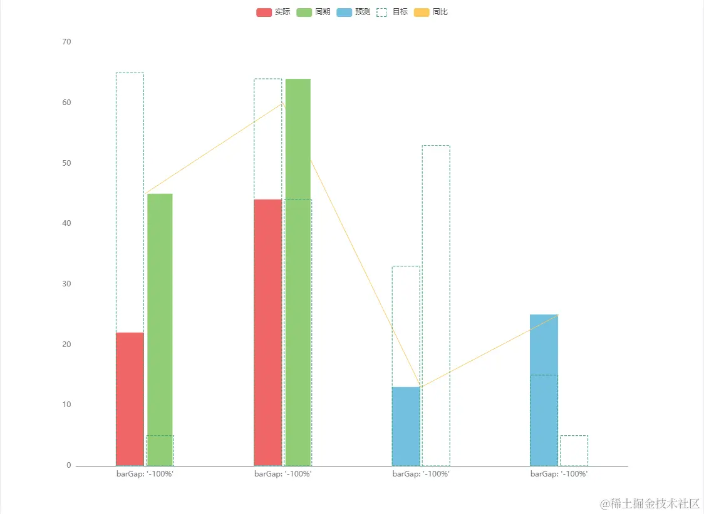

# 柱状图多柱虚线图层实现

> 废话不多说直接上代码

```js
const barWidth = 40
const iconTarget =
  'path://m912,132.00002l48,0l0,171.64286l-64,0l0,-114.42857l-160,0l0,-57.21429l176,0zm-800,0l-48,0l0,171.64286l64,0l0,-114.42857l160,0l0,-57.21429l-176,0zm784,743.78572l-160,0l0,57.21429l224,0l0,-228.85714l-64,0l0,171.64286zm-832,-457.71429l64,0l0,171.64286l-64,0l0,-171.64286zm0,286.07143l64,0l0,171.64286l-64,0l0,-171.64286zm0,171.64286l224,0l0,57.21429l-224,0l0,-57.21429zm352,0l192,0l0,57.21429l-192,0l0,-57.21429zm480,-429.10714l64,0l0,171.64286l-64,0l0,-171.64286zm-480,-314.67857l192,0l0,57.21429l-192,0l0,-57.21429z'

const lineData = [45, 60, 13, 25]

const createBar = function ({ params, api, style = {}, seriesIndex2 = 0 }) {
  console.log(seriesIndex2, 'seriesIndex2')
  const option = myChart.getOption()
  const barIndex = option.series
    .map((item, index) => {
      return item.type === 'bar' ? index : null
    })
    .filter((item) => item >= 0)

  var xValue = api.value(0)
  var yValue = api.value(1)

  // 显示的series index
  const seriesIndex = seriesIndex2
  // barWith
  const barWidth = 40
  // 宽补充
  const widthOffset = 4
  let width = barWidth
  const [x0, y0] = api.coord([0, 0])
  const [w, height] = api.size([api.value(seriesIndex), yValue])

  var currentSeriesIndices = api.currentSeriesIndices().filter((idx) => {
    return barIndex.includes(idx)
  })
  console.log(barIndex, currentSeriesIndices, seriesIndex)
  if (!currentSeriesIndices.includes(seriesIndex)) {
    return
  }
  // 找出seriesIndex所在的位置
  var index = currentSeriesIndices.findIndex((item) => seriesIndex === item)
  var barLayout = api.barLayout({
    barMaxWidth: barWidth,
    count: currentSeriesIndices.length
  })
  console.log('currentSeriesIndices', barIndex, currentSeriesIndices)

  var point = api.coord([xValue, yValue])
  console.log(index, point[0], barLayout, barLayout[seriesIndex])
  point[0] += barLayout[index]?.offset || 0
  if (barIndex === 1) {
    // point[0] += 4
  }

  barLayout[seriesIndex]?.width && (width = barLayout[seriesIndex]?.width + widthOffset)

  var myStyle = api.style({
    stroke: api.visual('color'),
    ...style
  })
  console.log(width, height, point[0], y0)
  return {
    type: 'rect',
    shape: {
      width: width,
      height: -height,
      x: point[0] - widthOffset / 2,
      y: y0
    },
    transition: 'shape',
    leaveTo: {
      // 淡出
      shape: { height: 0, width: 0 }
    },

    enterFrom: {
      shape: { height: 0 },
      // 从左飞入
      x: 0
    },

    style: myStyle
  }
}

const createLine = function ({ params, api, style = {} }) {
  const option = myChart.getOption()
  console.log(params, 'params')
  const barIndex = option.series
    .map((item, index) => {
      return item.type === 'bar' ? index : null
    })
    .filter((item) => item >= 0)

  var xValue = api.value(0)
  var yValue = api.value(1)
  console.log(xValue, yValue, 'aaaa')
  const nextXValue = params.dataIndex + 1
  const nextYValue = lineData[params.dataIndex + 1]

  var point = api.coord([xValue, yValue])
  var nextPoint = api.coord([nextXValue, nextYValue])

  var myStyle = api.style({
    stroke: api.visual('color'),
    ...style
  })

  return {
    type: 'line',
    shape: {
      x1: point[0],
      y1: point[1],
      x2: nextPoint[0],
      y2: nextPoint[1]
    },
    transition: 'shape',
    leaveTo: {
      // 淡出
      shape: { height: 0, width: 0 }
    },

    enterFrom: {
      shape: { height: 0 },
      // 从左飞入
      x: 0
    },

    style: myStyle
  }
}
option = {
  legend: {
    data: ['实际', '同期', '预测', '目标', '同比'].map((item) => {
      let obj = {}
      if (item === '目标') {
        obj = {
          icon: iconTarget,
          itemStyle: {
            borderType: 'dashed'
          }
        }
      }
      return {
        name: item,
        ...obj
      }
    })
  },
  xAxis: [
    {
      data: ['a', 'b', 'c', 'd'],
      axisTick: { show: false },
      axisLabel: {
        formatter: "barGap: '-100%'"
      }
    }
  ],
  yAxis: {
    splitLine: { show: false }
  },

  series: [
    {
      type: 'bar',
      name: '占位1',
      barMaxWidth: 40,
      z: 10
    },
    {
      type: 'bar',
      name: '同期',
      barMaxWidth: 40,
      z: 10,
      data: [45, 64, null, null]
    },

    {
      name: '同比',
      type: 'custom',
      renderItem: (params, api) => createLine({ params, api }),
      z: 10,
      data: lineData
    },
    {
      id: '实际',
      name: '实际',
      type: 'custom',
      renderItem: (params, api) => createBar({ params, api }),
      data: [22, 44, 0, 0]
    },
    {
      name: '预测',
      type: 'custom',
      renderItem: (params, api) => createBar({ params, api }),
      data: [0, 0, 13, 25]
    },
    {
      type: 'custom',
      name: '目标',
      renderItem: (params, api) =>
        createBar({
          params,
          api,
          style: {
            fill: 'transparent'
          },
          seriesIndex2: 0
        }),
      itemStyle: {
        borderWidth: 1,
        borderType: 'dashed'
      },
      data: [65, 64, 33, 15],
      z: 100
    },
    {
      type: 'custom',
      name: '目标',
      renderItem: (params, api) =>
        createBar({
          params,
          api,
          style: {
            fill: 'transparent'
          },
          seriesIndex2: 1
        }),
      itemStyle: {
        borderWidth: 1,
        borderType: 'dashed'
      },
      data: [5, 44, 53, 5],
      z: 100
    }
  ],
  animation: true
}
```

> 对应的实现效果


