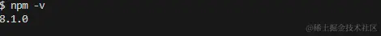
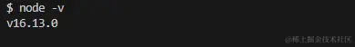
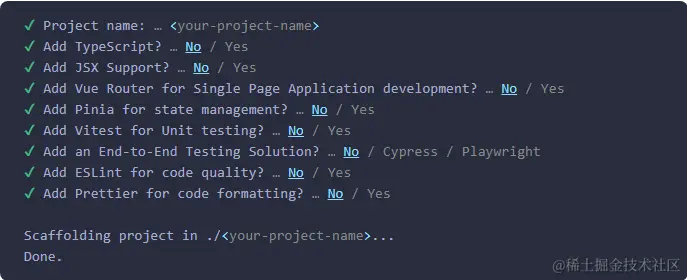

# 初始准备

[下载nvm](https://github.com/coreybutler/nvm-windows/releases)

安装node指定版本

1. `nvm list available`
2. `nvm install 16.13.0`
3. 查询node版本 `node -v `
4. 查询npm版本 `npm -v`
5. 出现对应代码结果
6. 
7. 

初始化vue应用

1. ` npm create vue@latest`
2. 
3.

```
// your-project-name 是你实际起的项目名称
cd your-project-name && npm i && npm run dev
```

4.测试打包是否有问题

```
npm run build
```

最后如果都没问题就开始愉快的开发吧!

[vue快速上手](https://cn.vuejs.org/guide/quick-start.html)
